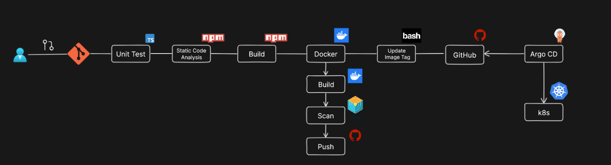

# DevSecOps CI/CD Pipeline – Tic-Tac-Toe Application

This repository implements a **complete DevSecOps CI/CD pipeline** using **GitHub Actions, Docker, Trivy, Kubernetes, and Argo CD**, deployed on a **Kubernetes cluster**.

The pipeline follows **industry-grade DevSecOps principles**:
- Immutable container images
- GitOps-based Kubernetes deployment
- Automated image vulnerability scanning
- Zero manual deployment steps

---

## 🧱 Architecture Overview



---

### Tools and Technologies used
- **React (TypeScript)**: Frontend web application for the Tic Tac Toe game  
- **Tailwind CSS**: Utility-first CSS framework for responsive and modern UI styling  
- **Docker**: Containerization of the React application
- **GitHub Actions**: CI pipeline for automated testing, linting, security scanning, Docker image build, push, and Kubernetes manifest updates
- **Github Container Registry (GHCR)**: Private container registry for storing and versioning application images  
- **Kubernetes**: Container orchestration platform for deploying and managing the application
- **NGINX Ingress Controller**:	Manages inbound traffic to services
- **ArgoCD**: GitOps-based continuous deployment tool

---

## Project Flow

This section describes the complete end-to-end DevSecOps workflow, from local development to automated deployment on Kubernetes using GitOps.

### 1. Local Setup and Running the application

### Prerequisites
- Node.js (v20+)
- npm
- Docker
- kubectl
- kind
- Git

### Clone the repository
```bash
git clone https://github.com/thrilokkvn/tic-tac-toe-devsecops.git
cd tic-tac-toe-devsecops
```

To run the application, execute the following commands:

**Install dependencies**
```bash
npm install
```

**Run the application locally**
```bash
npm run dev
```

**Run tests and lint checks**
```bash
npm test
npm run lint
```

### 2. Containerisation

The application uses a multi-stage Docker build to create a lightweight and secure production image.

#### Dockerfile Overview

**Build stage**: Installs dependencies and builds the React application

**Production stage**: Uses NGINX to serve static build files

Build and test docker image locally:

```bash
# Build the image
docker build -t tic-tac-toe:v1 .

# Run the container locally
docker run -d -p 8080:80 tic-tac-toe:v1
```

Verify locally
```bash
# Open in browser
http://localhost:8080
```

#### Authenticate Docker with GitHub Container Registry (GHCR)
To pull/push images from a private GHCR repository, authenticate Docker locally:
```bash
docker login ghcr.io

# Asks for username and password
Username: <github-username>
Password: <GITHUB_PAT> with read:packages and write:packages
```

### 3. Kubernetes Setup

#### General Kubernetes Steps

1. Create a Kubernetes cluster

2. Apply application manifests

3. Expose the application using a Service

4. Configure Ingress for external access

#### Kubernetes Setup using kind (Local)

Create a default cluster or create a kind-config.yaml file as below
```yaml
kind: Cluster
apiVersion: kind.x-k8s.io/v1alpha4
nodes:
  - role: control-plane
  - role: worker
  - role: worker
```

**Create kind cluster**
```bash
kind create cluster --name <cluster_name> --config kind-config.yaml
```

**Install NGINX Ingress Controller**
```bash
kubectl apply -f https://raw.githubusercontent.com/kubernetes/ingress-nginx/main/deploy/static/provider/kind/deploy.yaml
```

**Verify Ingress controller**
```bash
kubectl get pods -n ingress-nginx
```

**Create Docker Registry Secret for GHCR**
Since the Docker image is stored in a private GitHub Container Registry, Kubernetes must be explicitly authenticated to pull the image.
```bash
kubectl create secret docker-registry github-container-registry \
  --docker-server=ghcr.io \
  --docker-username=<github-username> \
  --docker-password=<GITHUB_PAT> \
  --docker-email=<email> \
  -n tic-tac-toe-devsecops
```

**Verify secret**
```bash
kubectl get secret github-container-registry -n tic-tac-toe-devsecops
```

**Reference ImagePullSecret in Deployment**
```yaml
imagePullSecrets:
  - name: github-container-registry
```

**Deploy application manifests**
```bash
kubectl apply -f kubernetes/
```

**Verify resources**
```bash
kubectl get pods -n tic-tac-toe-devsecops
kubectl get svc -n tic-tac-toe-devsecops
kubectl get ingress -n tic-tac-toe-devsecops
```

### 4. Github Actions Flow (CI)

The CI pipeline runs automatically on every push or pull request to the main branch.

#### CI Stages
1. Unit testing
2. Static code analysis (ESLint)
3. Application build
4. Docker image build
5. Image vulnerability scanning (Trivy)
6. Push image to GitHub Container Registry
7. Update Kubernetes deployment manifest (GitOps)

#### Key DevSecOps Controls
1. Pipeline fails on HIGH/CRITICAL vulnerabilities
2. Immutable Docker image tags (commit SHA-based)
3. Using private registry (GHCR) instead of public container registries
4. No direct kubectl usage in CI

### 5. Argo CD Setup and Configuration (CD)

Install Argo CD
```bash
kubectl create namespace argocd
kubectl apply -n argocd \
  -f https://raw.githubusercontent.com/argoproj/argo-cd/stable/manifests/install.yaml
```

Access Argo CD UI
```bash
kubectl port-forward svc/argocd-server -n argocd 8080:443
```

Open:
```bash
https://localhost:8080
```

Get the ArgoCD password using the following commands:
```bash
# Copy the password
kubectl get secret argocd-initial-admin-secret -n argocd -o yaml

# Decode the base64 password
echo <BASE64_PASSWORD> | base64 --decode
```

### 6. Testing the Complete Pipeline
**End-to-End Validation Flow**
1. Make a code change
2. Push changes to main
3. GitHub Actions CI pipeline executes
4. Docker image is built, scanned, and pushed
5. Kubernetes deployment manifest is updated
6. Argo CD detects the change and syncs automatically
7. New pods roll out with the updated image

## Cleanup

### 1. Uninstall ArgoCD

```bash
kubectl delete -n argocd -f https://raw.githubusercontent.com/argoproj/argo-cd/stable/manifests/install.yaml
kubectl delete namespace argocd
```

### 2. Uninstall Ingress Controller

```bash
kubectl delete -f https://raw.githubusercontent.com/kubernetes/ingress-nginx/controller-v1.13.3/deploy/static/provider/cloud/deploy.yaml
```

### 3. Delete application resources

```bash
kubectl delete -f kubernetes/
```

### 4. Delete kind cluster

```bash
kind delete cluster --name <cluster_name>
```